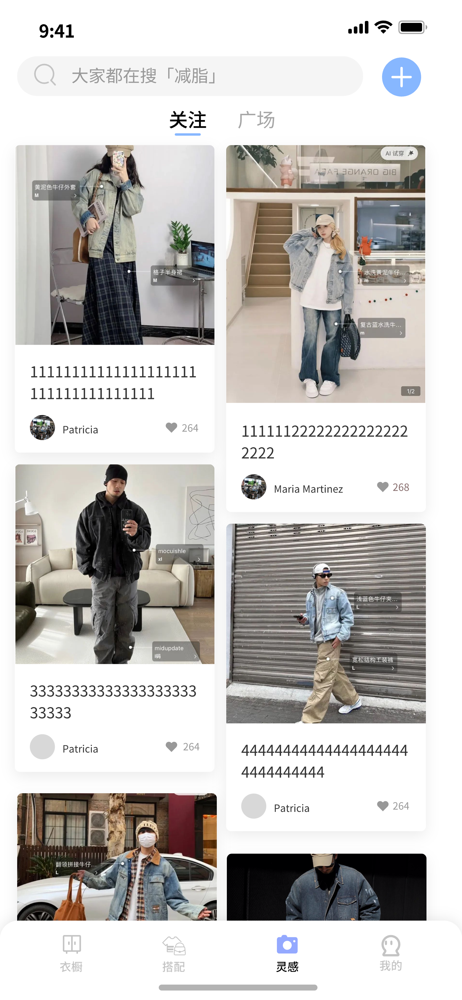

# WearWizard

An app for fashion

## Submodule

客户端：[FaterYU/WearWizard (github.com)](https://github.com/FaterYU/WearWizard)

服务端：[LightHouseAC/WearWizard-Backend (github.com)](https://github.com/LightHouseAC/WearWizard-Backend)

衣服分割&识别模型训练：[FaterYU/ClothClassify (github.com)](https://github.com/FaterYU/ClothClassify)

算法推理服务：[FaterYU/ClothSegmentNCNN-libhv: Cloth segment on yolov8-seg model with NCNN (github.com)](https://github.com/FaterYU/ClothSegmentNCNN-libhv)

算法推理服务镜像：[fateryu/wearwizard - Docker Image | Docker Hub](https://hub.docker.com/r/fateryu/wearwizard)

仿真穿搭合成接口：[FaterYU/OutfitAnyoneAPI: API of Outfit Anyone main function (github.com)](https://github.com/FaterYU/OutfitAnyoneAPI)

## Getting Started

```bash
cd wearwizard
flutter emulator --launch <YOUR EMULATOR ID>
flutter run
```

## Prototype

<div style="text-align: center;">


<br>



</div>

## Build APK

```bash
flutter build apk --target-platform android-arm --split-per-abi
```
